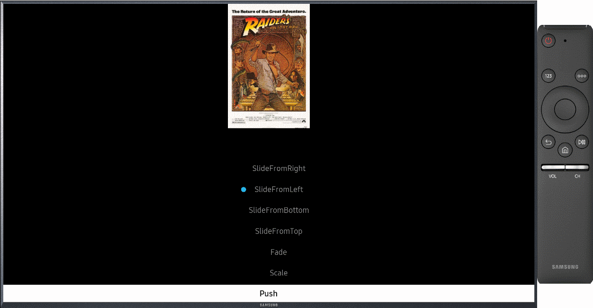
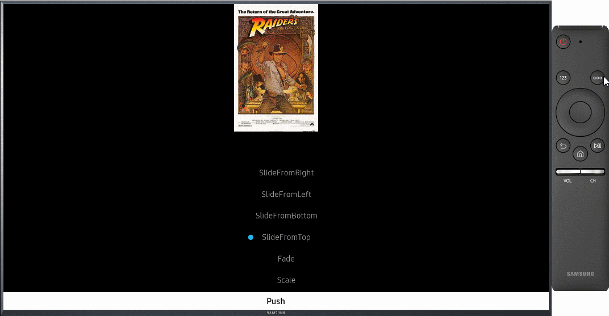

# AnimatedNavigationPage
## Introduction
`AnimatedNavigationPage` is a subclass of `Xamarin.Forms.NavigationPage` that support page tranisition animation when the page is popped or pushed. Each page can define a push transition animation and pop transition animation respectively using the attached properties below.

 - SetPushAnimation()
 - SetPushAnimationRate()
 - SetPushAnimationLength()
 - SetPopAnimation()
 - SetPopAnimationRate()
 - SetPopAnimationLength()

When the page is pushed or popped through `AnimatedNavigationPage`, the defined animation will run.

## Creating the Root Page

The first page added to a navigation stack is referred to as the root page of the application, and the following code example shows how this is accomplished:

``` c#
public App ()
{
  MainPage = new AnimatedNavigationPage (new MyPage());
}
```

This causes the MyPage ContentPage instance to be pushed onto the navigation stack, where it becomes the active page and the root page of the application.

## Describing the Page Transition Animations

Through various attached properties provided by `AnimatablePage`, all pages can define push/pop animation as shown below.

``` c#
public MyPage ()
{
  var pushAnim = new Animation (v => Opacity = v, 0, 1);
  var popAnim = new Animation (v => Opacity = v, 1, 0);
  this.SetPushAnimation(pushAnim);
  this.SetPopAnimation(popAnim);
}
```

You can define your own page transition animations like this.


## Using the AnimatedContentPage

For convenience, we provide predefined page transition animations through `AnimatedContentPage`. `AnimatedContentPage` is a subclass of `Xamarin.Forms.ContentPage` that provide pre-defined page tranisition animation. The `PageTransition` property allows you to set pre-defined page transition animations for each pages. The predefined page transition animations are as follows.
 - `SlideFromLeft` : Slide from left to right on push, and slide from right to left on pop
   
 - `SlideFromRight` : Slide from right to left on push, and slide from left to right on pop
   
 - `SlideFromTop` : Slide from top to bottom on push, and slide from bottom to top on pop
   
 - `SlideFromBottom` : Slide from bottom to top on push, and slide from top to bottom on pop
   
 - `Fade` : Show a fade animation
   
 - `Scale` : Show a scale animation
   


``` c#
var page = new AnimatedContentPage
{
    PageTranistion = PageTranistion.SlideFromRight
};

//Push a page
await Navigation.PushAsync(page);

//Pop a page
await Navigation.PopAsync();
```

## Limitations
The basic page navigating method is the same as `Xamarin.Forms.NavigationPage`, but the following methods and properties are not supported.
 - BackButtonTitle
 - HasNavigationBar
 - HasBackButton
 - Tint
 - BarBackgroundColor
 - BarBackground
 - BarTextColor
 - TitleIcon
 - IconColor
 - TitleView

## Related Links
 * [API reference](https://samsung.github.io/Tizen.TV.UIControls/api/Tizen.TV.UIControls.Forms.AnimatedNavigationPage.html)
 * [Sample](https://github.com/Samsung/Tizen.TV.UIControls/tree/master/sample/Sample/AnimatedNaviPage)
