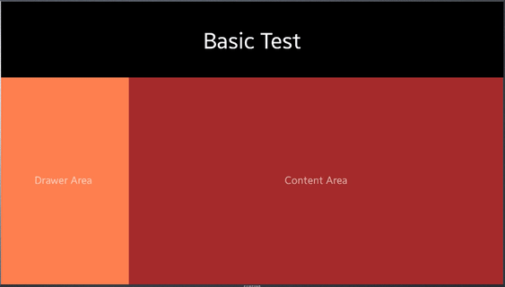
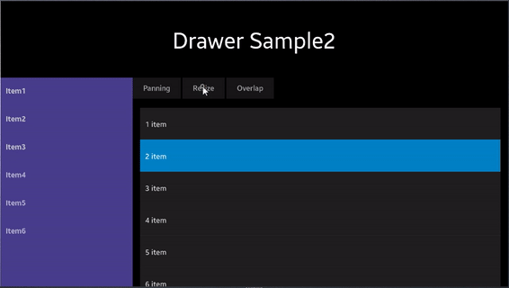

# DrawerLayout
## Introduction
`DrawerLayout` is a kind of `Layout` that acts like a `MasterDetailPage`. it has a drawer part that interactively pull and push. Drawer part can control with `IsOpen` property. The open and close action are including animation.

### Drawer and Content
 `DrawerLayout` is consist of `Drawer` and `Content` view. `Drawer` is a moving part, `Content` is fixed part.
 `Drawer` is like a `MasterPage` and `Content` is like a `DetailPage` in `MasterDetailPage`.

### DrawerMode
The developer can control the layout of the content when the drawer was opened by using `DrawerMode`
#### DrawerMode.Resize (default)
It is default behavior, Content view is resized to open drawer view

#### DrawerMode.Panning
Content view is moved to side

#### DrawerMode.Overlap
 Drawer view is overlapped above content view

### DrawerPosition
Developers can set position of the drawer. it default on the left side. but if RTL(Right to left) mode enabled, it default on the right side. 

### DrawerClosedWidth
Developers can set the width of the closed drawer.
