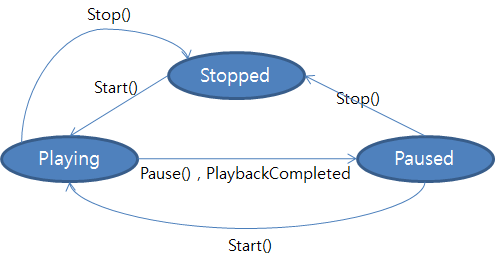

# MediaPlayer
## Introduction
MediaPlayer provides functionality of playing multimedia. It also includes related view components that display video stream.

## How to use
#### C#
``` c#
var view = new MediaView();
var player = new MediaPlayer();
player.VideoOutput = view;
player.Source = "a.mp4";
player.Start();
```
#### XAML
``` xaml
<tvcontrols:MediaView>
    <tvcontrols:MediaPlayer
        Source="{Binding Source}"
        AutoStart="true"/>
</tvcontrols:MediaView>
```

## PlaybackState
 MediaPlayer has PlaybackState. Some APIs only work on the certain state and some APIs transit the state.
#### State diagram of PlaybackState



## Video output types
#### Overlay
 * It displays video data on the overlay plane. It is more efficient and fast but has a limit shape. Usually it is used to display video as fullscreen.
 * OverlayPage
 * OverlayMediaView
#### Buffer
 * It displays video data on the graphics buffer using GL surface. It is free to change the shape, but if it does not support GL surface, you can't use it. It is usually used to attach a video on a part of the view.
 * MediaView


## Associating Player with media view
 MediaPlayer and MediaView are created independently. To display video data into MediaView, the developer needs to associate Player and MediaView.

#### Use VideoOutput property of Player
``` c#
 player.VideoOutput = new MediaView();
```

#### Use Player property of MediaView
``` xaml
<tvcontrols:MediaView>
    <tvcontrols:MediaView.Player>
        <tvcontrols:MediaPlayer Source="{Binding Source}"/>
    </tvcontrols:MediaView.Player>
</tvcontrols:MediaView>
```
``` c#
 mediaView.Player = new MediaPlayer();
```


## Embedding controls
 By default, MediaPlayer provides an embedding control. If you don't want to use the default embedding controls, set UsesEmbeddingControls to false.
``` c#
public bool UsesEmbeddingControls
```


## AutoPlay/AutoStop
Video can't play before media view is shown, so you need to know when the media views are available. If you use AutoPlay/AutoStop property, you don't need to care about view state.
#### AutoPlay
``` c#
public bool AutoPlay
```
 Automatically starts a player when a View was shown (Rendered)
#### AutoStop
``` c#
public bool AutoStop
```
Automatically stops a player when a View was gone (Renderer was disposed)

## Related Links
 * [Sample](https://github.com/Samsung/Tizen.TV.UIControls/tree/master/sample/Sample/MediaPlayer)