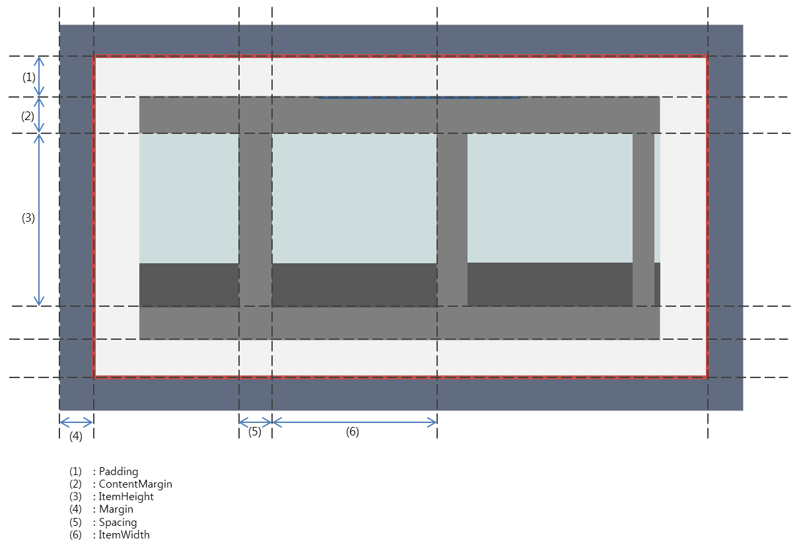

# RecycleItemsView
## Introduction
 `RecycleItemsView` is a view that takes in a list of user objects and produces views for each of them to be displayed. Especially, it can be used when the data is displayed in the same view template. It reuses the templated view when it is out of sight.

## Concept


## How to use
### C#
```c#
var recycleView = new RecycleItemsView()
{
    ContentMargin = 60,
    ItemHeight = 350,
    ItemWidth = 300,
    Spacing = 20,
    ItemsSource = item,
    ItemTemplate = new DataTemplate(() =>
    {
        Label label;
        var view = new StackLayout {
            Children =
            {
                (label = new Label { })
            }
        };
        view.SetBinding(StackLayout.BackgroundColorProperty, new Binding("Color"));
        label.SetBinding(Label.TextProperty, new Binding("Label"));
        return view;
    })
}),
```
### XAML
``` xml
<tvcontrols:RecycleItemsView ContentMargin="60" ItemWidth="300" ItemHeight="350" Spacing="20" ItemsSource="{Binding Items}">
    <tvcontrols:RecycleItemsView.ItemTemplate>
        <DataTemplate>
            <StackLayout BackgroundColor="{Binding Color}">
                <Label Text="{Binding Text}"/>
            </StackLayout>
        </DataTemplate>
    </tvcontrols:RecycleItemsView.ItemTemplate>
</tvcontrols:RecycleItemsView>
```
## Properties related layouting


### Item width and height
All items in `RecycleItemsView` have the same width and height, because it should be reused.

## Multiple columns
You can display items on multiple lines. Use `ColumnCount` property to apply multiple columns.


## Header and Footer
 `RecycleItemsView` displays items with a same `DataTemplate`. If you want to use special looks for first or last, you can use Header or Footer property.


 The Header and Footer can be data objects that contain a view model or a view instance.
 If Header or Footer is a View, it is directly used for displaying header or footer.
 If not, `HeaderTemplate` or `FooterTemplate` is used to make a view that is used for displaying header or footer.

## Related Links
 * [DataTemplate](https://docs.microsoft.com/en-us/xamarin/xamarin-forms/app-fundamentals/templates/data-templates)
 * [Sample](https://github.com/Samsung/Tizen.TV.UIControls/tree/master/sample/Sample/RecycleItemsView)